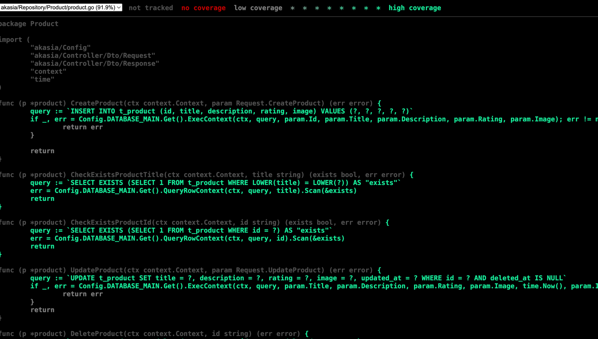

# AKASIA

Tech Stack:
- Golang 1.19
- Echo 3.3.10
- MySql
- sqlmock -> for mocking Sql driver data-dog/go-sqlmock 

## Architecture
```
├── Config
|   ├── databaseEngine.go
|   ├── engine.go
|   ├── interface.go
|   └── model.go
├── Controller
|   ├── Dto
|   |   ├── Request
|   |   |   └── product.go
|   |   └── Response
|   |   |   ├── product.go
|   |   |   └── response.go
|   ├── controllerProduct.go
|   └── interface.go
├── Environment
|   └── Local.yml
├── Repository
|   ├── Product
|   |   ├── model.go
|   |   └── product.go
|   └── interface.go
├── Routes
|   └── route.go
├── Service
|   ├── Migration
|   |   └── 20231219database_migration.sql
|   └── service.go
├── .gitignore
├── go.mod
|   └── go.sum
├── main.go
└── README.md

```

## How to Run
- [Scripts](#scripts)
    - [Terminal](#terminal)

### Scripts
Script go running on terminal, before that you must direct to the path project after clone this project from GIT

### Terminal
```bash
# Running project
go run main.go

# Running unit test
go test -covermode=count -coverprofile=cp.out

# See Coverage unit test on browser
go tool cover -html=cp.out
```

this covarage unit test:
- unit test coverage 91.9% code repository all logic for store data to database with Sql driver
